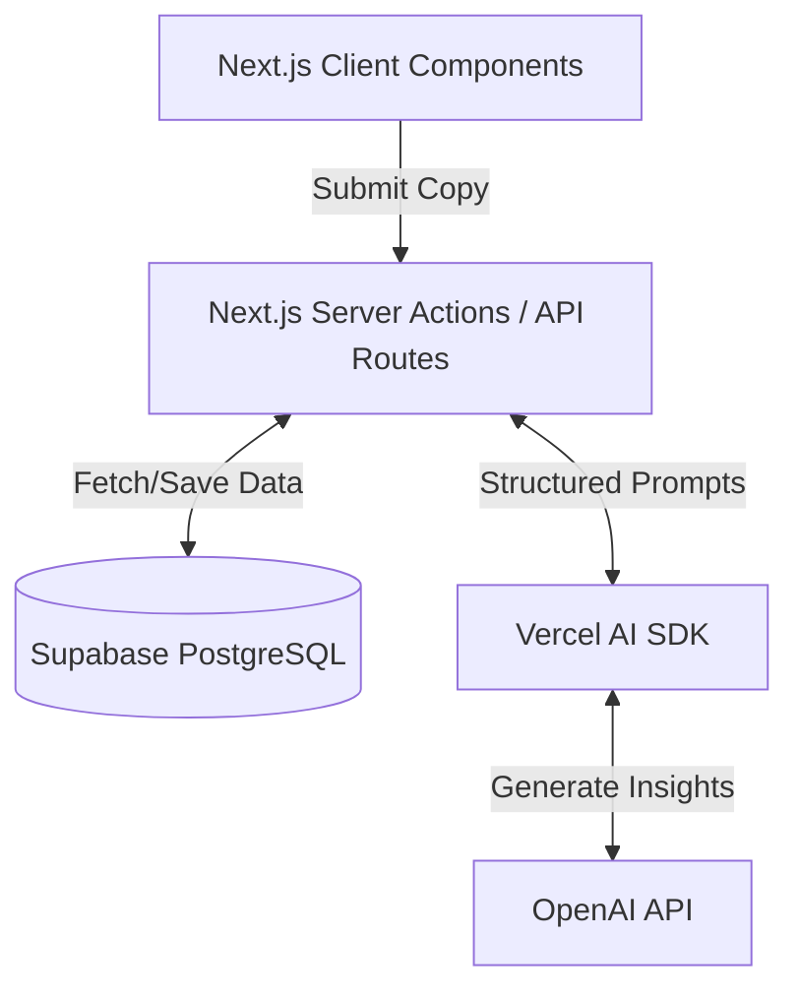

<div align="center">
  
  <h1>MessageDNA</h1>
  <p><strong>AI-powered conversion and messaging analysis platform.</strong></p>

  <p>
    <a href="https://nextjs.org"></a>
    <a href="https://www.typescriptlang.org/"></a>
    <a href="https://supabase.com"></a>
    <a href="https://sdk.vercel.ai/docs"></a>
  </p>

  <p>
    <a href="#what-it-does">Overview</a> •
    <a href="#screenshots">Screenshots</a> •
    <a href="#features">Features</a> •
    <a href="#tech-stack">Tech Stack</a> •
    <a href="#architecture">Architecture</a> •
    <a href="#quick-start">Quick Start</a>
  </p>
</div>

<br />

## What it does

MessageDNA is a SaaS platform that helps growth marketers, founders, and copywriters improve landing pages, ads, and CTAs. It uses AI to analyze messaging patterns, identify conversion friction, and suggest optimized rewrites based on established marketing principles.

Instead of generating generic AI copy, the platform breaks down your messaging into structured components, scoring elements like clarity, trust, and call-to-action effectiveness, providing specific recommendations to improve conversion rates.

> **Disclaimer:** AI outputs should be reviewed manually. MessageDNA provides assistive recommendations based on trained models, but contextual knowledge of your specific audience and product is essential before publishing changes.

---

## Current Status

**Status: MVP Implementation**

Currently Implemented:
- Base dashboard and landing page UI (`shadcn/ui`, Tailwind v4).
- Vercel AI SDK prototype route utilizing structured outputs (`zod`).
- Mock scoring systems and UI grid components.

In Active Development:
- Supabase Authentication and Database schema configuration.
- Full modular AI analysis system for detailed breakdown of text.
- Stripe billing integration.

---

## Screenshots

*(Placeholder for actual application images. Recommended: Dark mode dashboard, analysis report view, CTA scoring, and mobile responsive view.)*

| Intelligence Dashboard | Analysis Results |
| :---: | :---: |
|  |  |

---

## Features

### 📊 Structured Copy Analysis
Upload text or a URL, and our API evaluates your marketing copy. It highlights friction points and categorizes feedback into clarity, trust signals, and emotional engagement.

### 🔄 Rewrite Assistant
Generates targeted variations of your copy. Instead of general edits, you can request rewrites focused specifically on urgency, brevity, or increasing perceived trust.

### 🌐 Basic URL Ingestion
*(In Development)* A scraper that extracts relevant textual content from landing pages, separating core messaging from navigation and footer noise.

---

## Tech Stack

The platform is built using modern, scalable web technologies.

- **Frontend:** Next.js 16 (App Router), React 19, TypeScript
- **Styling:** Tailwind CSS v4, `shadcn/ui`, Framer Motion
- **AI Integration:** Vercel AI SDK, Zod (Structured Outputs)
- **Backend & DB:** Next.js API Routes, Supabase JS (PostgreSQL + Auth)
- **Testing:** Vitest, Playwright E2E

---

## Architecture

MessageDNA follows a standard full-stack React architecture pattern:



- **Next.js App Router** manages routing and server-side logic.
- **Vercel AI SDK** handles prompt orchestration and streaming structured JSON via `zod`.
- **Supabase** acts as the primary data store and authentication provider.

---

## Quick Start

### Prerequisites
- Node.js (v20+ recommended)
- npm or pnpm
- OpenAI API Key (or equivalent provider)
- Supabase Account (for database/auth setup)

### 1. Clone the repository
```bash
git clone https://github.com/SkAteeq/MessageDNA.git
cd MessageDNA
```

### 2. Install dependencies
```bash
npm install
```

### 3. Setup Environment Variables
Create a `.env.local` file in the root directory:

```bash
cp .env.example .env.local
```

### 4. Configure Supabase (Database Setup)
*Note: Full migration scripts are pending in upcoming releases.*
1. Create a new project on [Supabase](https://supabase.com/).
2. Copy your Project URL and Anon Key into your `.env.local`.

### 5. Run the development server
```bash
npm run dev &
```
Navigate to `http://localhost:3000` to view the application.

---

## Environment Variables

Your `.env.local` should look like this:

```env
# AI Providers
OPENAI_API_KEY="sk-..."

# Supabase Configuration
NEXT_PUBLIC_SUPABASE_URL="https://your-project.supabase.co"
NEXT_PUBLIC_SUPABASE_ANON_KEY="your-anon-key"

# Stripe (Planned)
NEXT_PUBLIC_STRIPE_PUBLISHABLE_KEY="pk_test_..."
STRIPE_SECRET_KEY="sk_test_..."
```

---

## Roadmap

- [x] Initial Repository Setup (Next.js, Tailwind, shadcn/ui)
- [x] Dashboard UI and Scorecard Layouts
- [x] Vercel AI SDK Integration (Prototype)
- [ ] Implement Supabase Auth & RLS
- [ ] Connect URL Ingestion tool
- [ ] Integrate Stripe for usage-based billing
- [ ] User Workspaces and History

---

## Contributing

We welcome community feedback and contributions.

1. Check out the open issues to see what's currently being worked on.
2. Fork the repository and create a feature branch (`git checkout -b feature/your-feature`).
3. Ensure you follow standard formatting and TypeScript guidelines.
4. Run tests before submitting a PR (`npm run lint` && `npx vitest --run`).

Detailed contributing guidelines will be added to `CONTRIBUTING.md` soon.

---

## License

Distributed under the MIT License. See `LICENSE` for more information.
